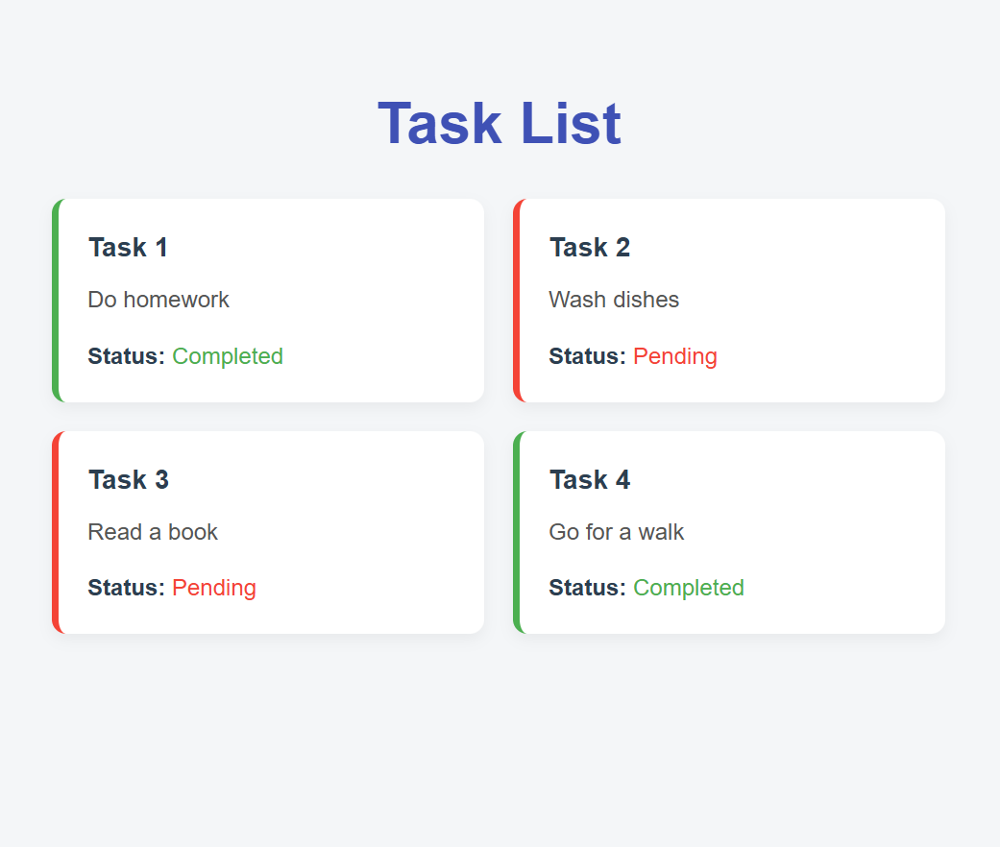

# 📝 TaskCard React App

A simple React app built using **Vite + React (JavaScript)** that displays a list of tasks using a reusable `TaskCard` component. Each task shows its title, description, and completion status with a clean, unified color palette.

---

## Assets





## 🚀 Features

-  Built with Vite + React
-  Reusable `TaskCard` component
-  Clean UI with soft blue-gray palette
-  Dummy task data passed via props
-  Responsive layout with minimal styling

---
## Steps 

### 1. Clone the repository (or create your own using Vite)
```bash
npm create vite@latest task-card-app
cd task-card-app
```

### 2. Install dependencies
```
npm install
```

### 3. Run the development server
```
npm run dev
```


