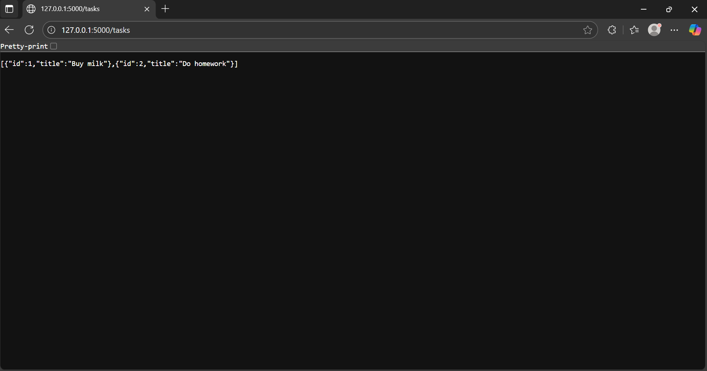
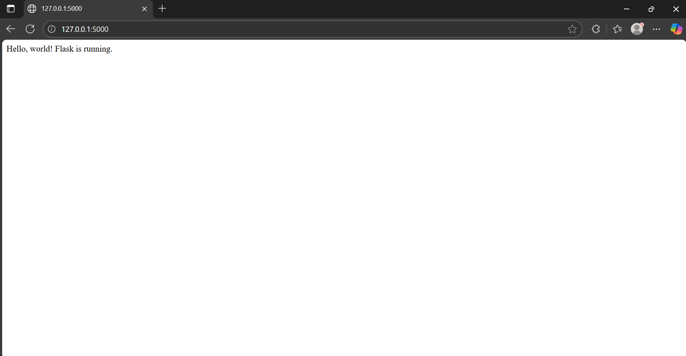
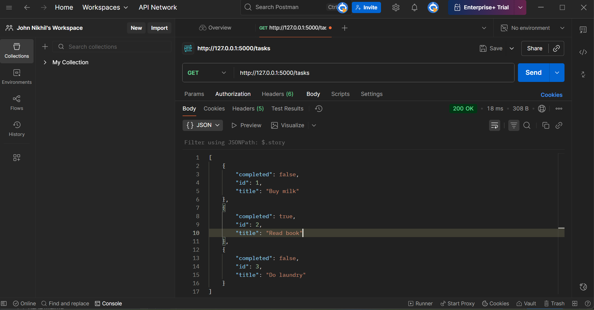
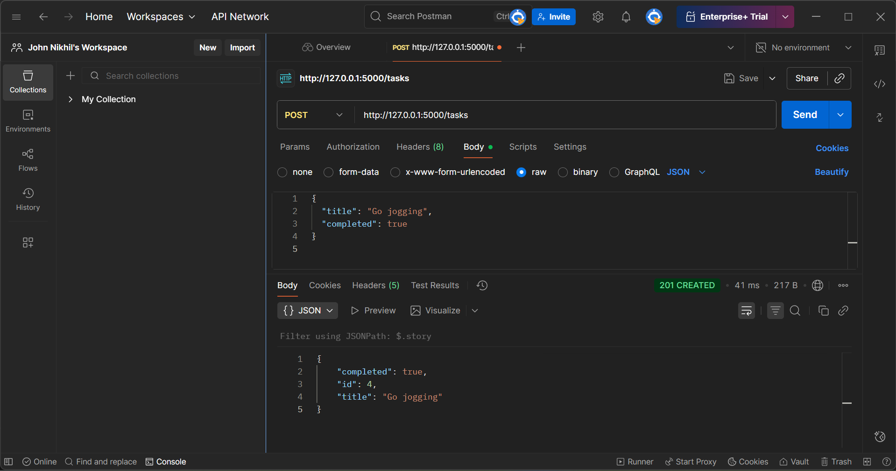

# Flask Tasks App

A simple Flask-based task management API that allows you to view and add tasks.  
Built for learning and practice purposes using Flask with in-memory storage.

---

## Features

- **Home Route (/): Displays a welcome message.  
- **GET /tasks**: Retrieves all tasks as JSON.  
- **POST /tasks**: Adds a new task by sending a JSON payload.  
- *In-memory Storage*: Tasks reset when the server restarts.  

---

## Installation

1. Create a flasks_tasks app in Week03/Day1.Go to the designated directory and insatll flask.
```
pip install flask
```
2. Running:

### Activate virtual environment:
```
source ../../venv/Scripts/activate  
```

### Set Flask app
```
export FLASK_APP=app.py 
```   


### Run the Flask server
```
flask run
```


## App Screenshots:

### Tasks:



### Main Page:



### GET:



### POST:



