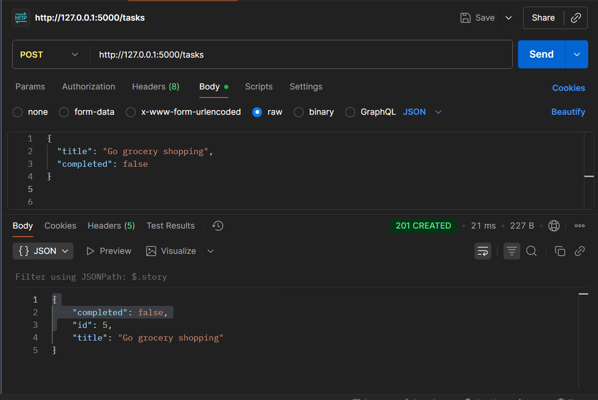
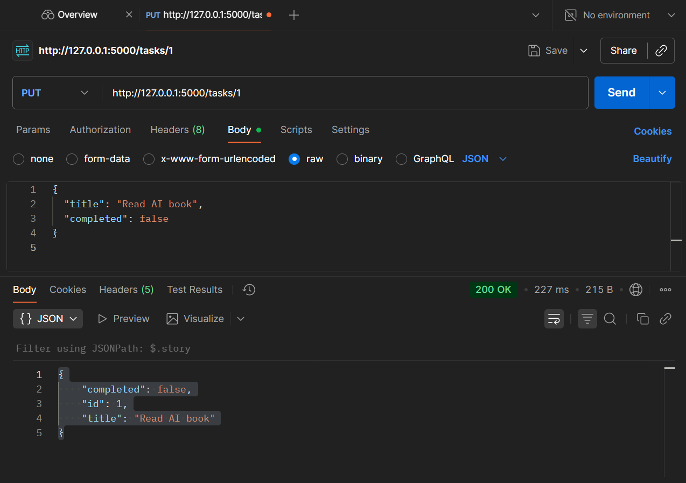
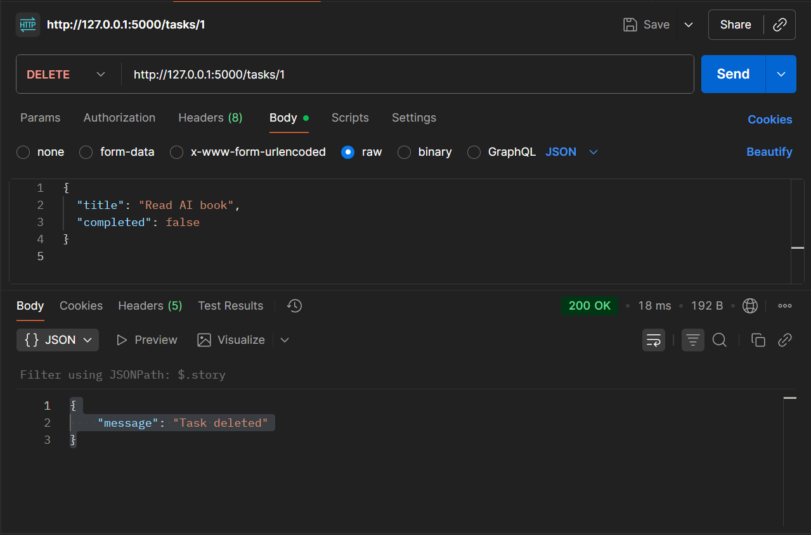

# 📝 Week3 Day2 — [Oct 8]

## Learning Topics
- POST / PUT / DELETE endpoints
- Parameter passing
- Path vs query parameters
- Using Postman to test API requests

---

## Task
- Implement endpoints:  
  - `POST /tasks` → Add a new task  
  - `PUT /tasks/<id>` → Update an existing task  
  - `DELETE /tasks/<id>` → Delete a task  
- Optional filtering via query: `?completed=true`

---

## Steps Followed

1. **Activate venv**
```bash
..\venv\Scripts\activate
```

2. **Run App**
```
flask run
```

3. **App.js**

Added basic code that i could test on Postman.

4. **Postman**

-Perform POST to add tasks in POSTMAN.

-Perform PUT to update a particular task.

-Perform DELETE to delete a particular task.


## App Screenshots:

### POST:



### PUT:



### DELETE:



