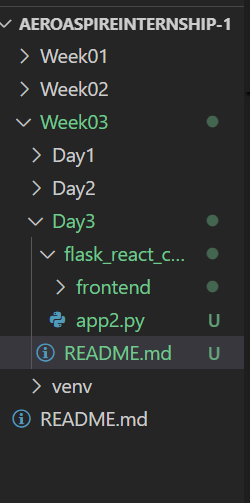
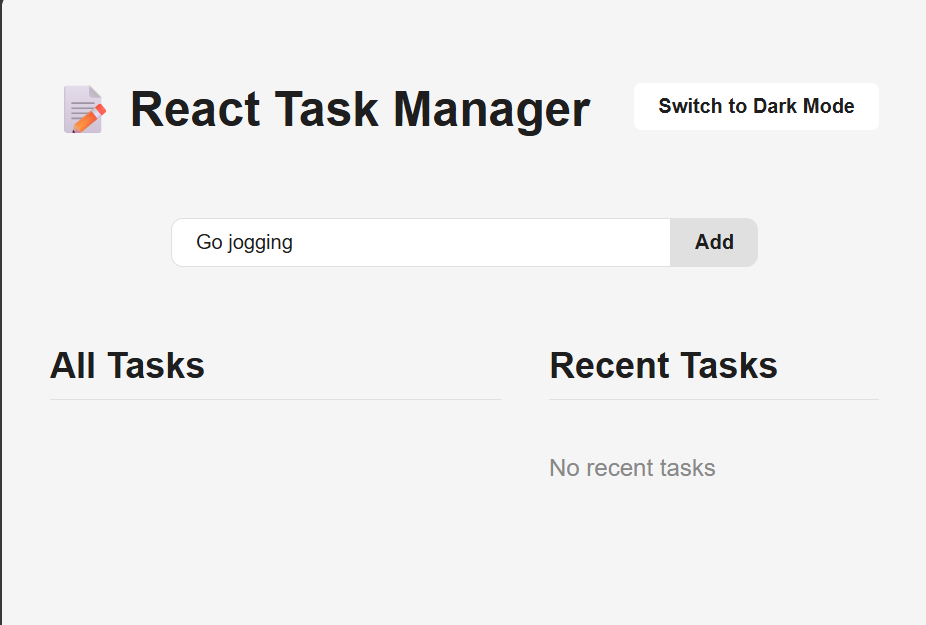
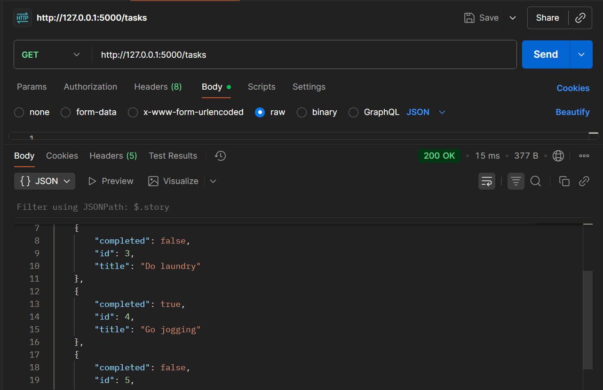

# React + Flask Task Manager

A simple task manager app with **Flask backend** and **React frontend**.  

**Features:**
- Add, complete, delete tasks  
- Recent tasks column (last 5 inputs)  
- Light/Dark theme toggle  
- Sleek monochrome (dark) and neutral (light) design  

---

## 1️⃣ Backend (Flask)

### Install dependencies
```bash
cd flask_react_cors     
pip install flask flask-cors
```
### Run Flask API
```
python app2.py
```

## 2️⃣ Frontend (React)
```
 ## Create React app :

npx create-react-app react-flask-frontend
cd react-flask-frontend

 ## Install dependencies :

npm install
Run React app
npm start


 ## Features :

Add task
Complete/Toggle task
Light/Dark theme toggle

```

## Folder Setup:



## Reactive Screenshots:

### Frontend:




### Backend:

#### (id=4)





