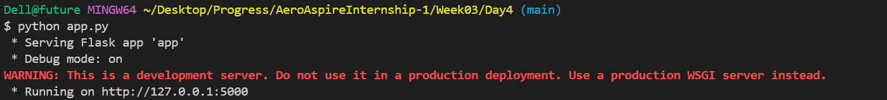
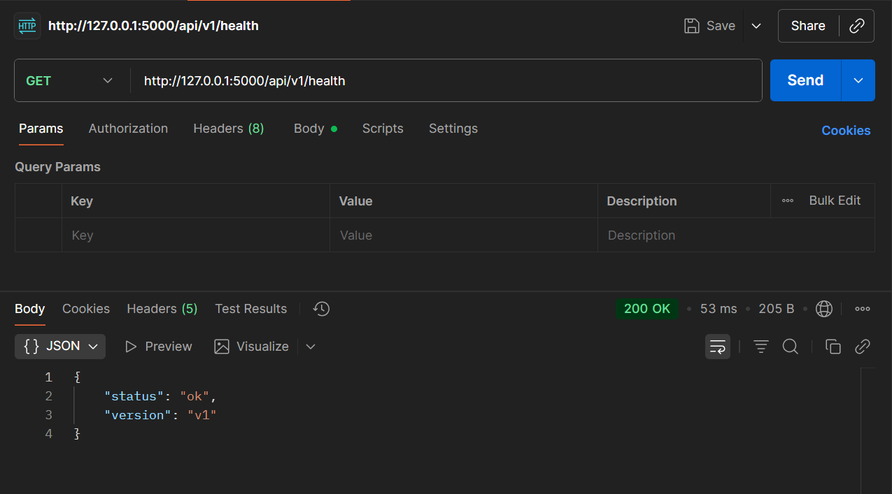
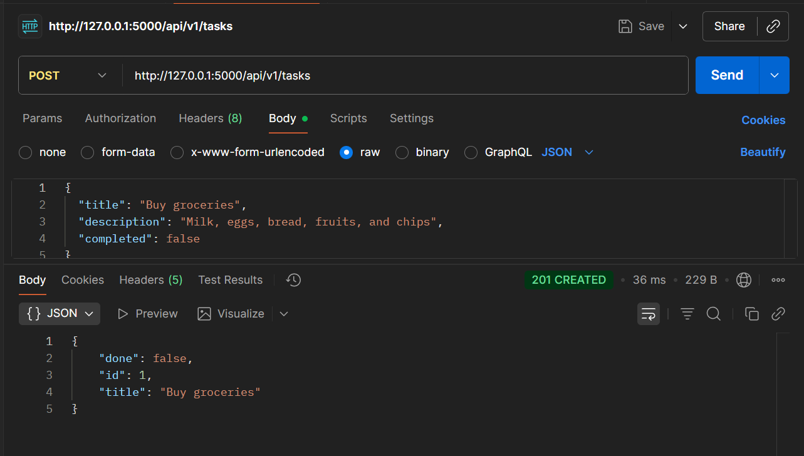
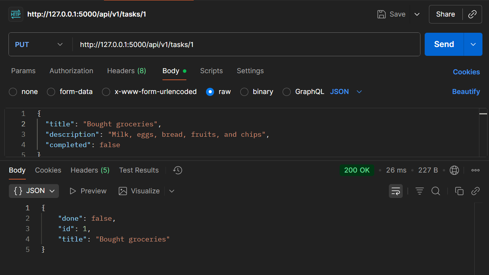
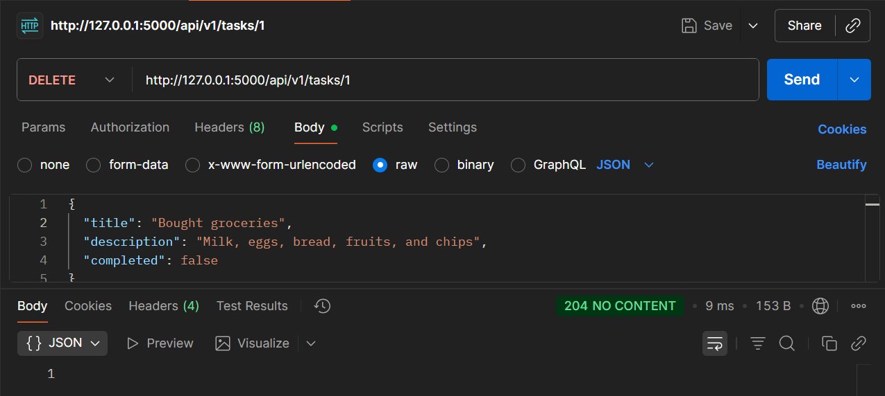

# Week03 - Day4: Tasks API (v1)

## Overview
This is a simple Flask API for managing tasks.  
API is **versioned under `/api/v1`**.

- Language: Python  
- Framework: Flask  
- Documentation: Markdown  

---

## Setup Instructions

1. **Open terminal in `Week03/Day4`**
```bash
cd Week03/Day4
```
2. **Install dependencies**
```
pip install -r requirements.txt
```
3. **Run the API**
```
python app.py
```

## Step-by-Step Testing
1. **Open home page**

Go to http://127.0.0.1:5000 in browser.

*You will see welcome message and links.*

2. **Check health**

GET request:
```
 http://127.0.0.1:5000/api/v1/health
 ```

*Output*:

{"status": "ok", "version": "v1"}


3. **List tasks**

GET request: 
```
http://127.0.0.1:5000/api/v1/tasks
```

*Shows all tasks.*

4. **Add a new task**

POST request:
```
 http://127.0.0.1:5000/api/v1/tasks
 ```


6. **Update a task**

PUT request:
```
 http://127.0.0.1:5000/api/v1/tasks/1
 ```


7. **Delete a task**

DELETE request: 
```
http://127.0.0.1:5000/api/v1/tasks/1
```

## Screenshots:


*Main Page:*

 

*Running Locally:*

 

*Get:*

 

*Post:*

 

*Put:*



*Delete:*




