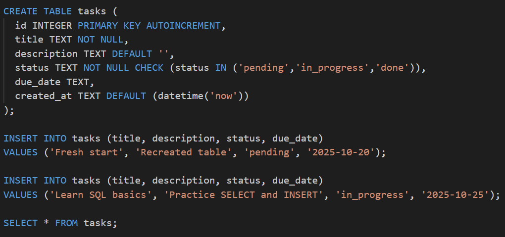
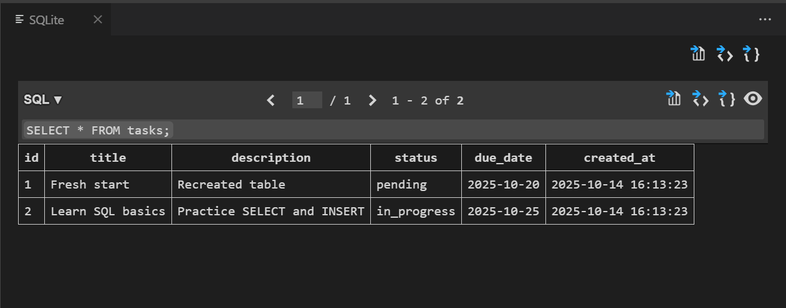

# Day 1 – SQLite Tasks Table

This project demonstrates creating and managing a simple tasks table using SQLite in VS Code.

---

## Project Overview

The project is about creating a tasks database to store your tasks with basic information:

- `id` – unique identifier (autogenerated)  
- `title` – name of the task  
- `description` – optional details about the task  
- `status` – tracks progress (`pending`, `in_progress`, `done`)  
- `due_date` – optional due date  
- `created_at` – timestamp when the task was added  

We also demonstrate inserting data and viewing the table inside VS Code using the SQLite extension.

---

## Steps to Set Up

1. Open VS Code and your project folder (`Day1`).  
2. Install the SQLite extension by alexcvzz.  
3. Create a new database file: `tasks.db`.  
4. Create a SQL file: `schema.sql` and paste the following:

```sql
CREATE TABLE tasks (
  id INTEGER PRIMARY KEY AUTOINCREMENT,
  title TEXT NOT NULL,
  description TEXT DEFAULT '',
  status TEXT NOT NULL CHECK (status IN ('pending','in_progress','done')),
  due_date TEXT,
  created_at TEXT DEFAULT (datetime('now'))
);

INSERT INTO tasks (title, description, status, due_date)
VALUES ('Fresh start', 'Recreated table', 'pending', '2025-10-20');

SELECT * FROM tasks;
```
5. Open the database in VS Code:
```
Command Palette → SQLite: Open Database → select tasks.db.
 ```

7. Run the SQL queries in schema.sql:
```
Highlight the lines → Right-click → Run Query → choose tasks.db.
```

8. View the table:
```
In SQLite Explorer, right-click tasks → Show Table.
```
## Screenshots:







