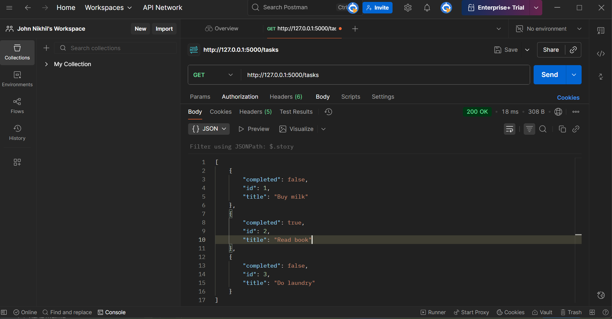
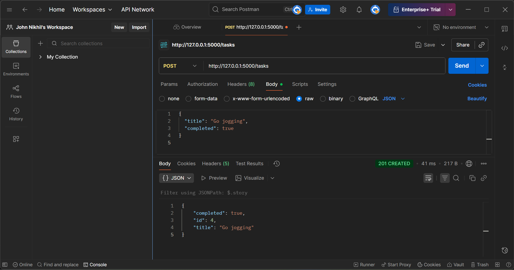
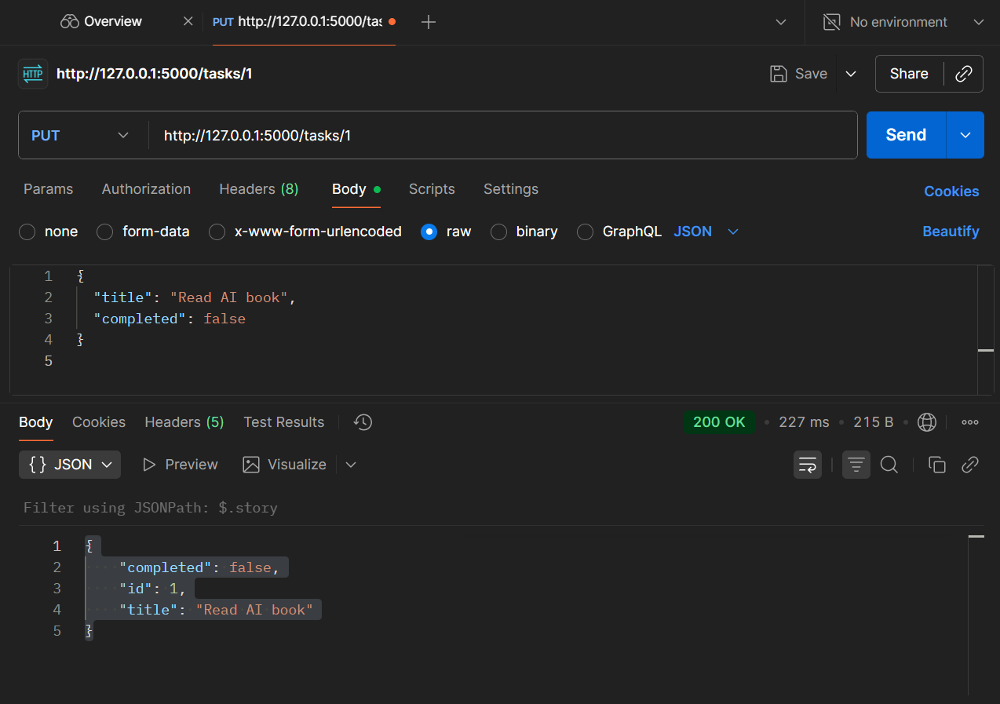
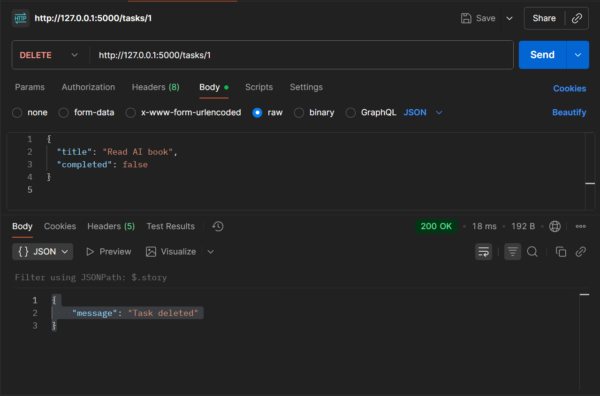

# Week03 - Day4: Tasks API with Database (v1)

## Overview
This is a small Flask API to manage tasks using **SQLite database**.  
You can **add, view, update, and delete tasks**.  
API version is **v1**.

- Language: Python  
- Framework: Flask + SQLAlchemy  
- Database: SQLite (`tasks.db`)  
- Documentation: Markdown  

---

## Step-by-Step Setup (with venv)

### 1. Go to Day4 folder
```bash
cd Week03/Day4
```

### 2.Create virtual environment
```
python -m venv .venv
```

### 3. Activate virtual environment
```
.venv\Scripts\activate
```

### 4. Install Flask and SQLAlchemy
```
pip install Flask==2.2.2 Flask-SQLAlchemy==3.0.5
```

### 5. Create app.py

### 6. Run the API
```
python app.py
```

# Screenshots:

*Get:*
  
 *Post:*
 
 *Put:*
  
  *Delete:*



